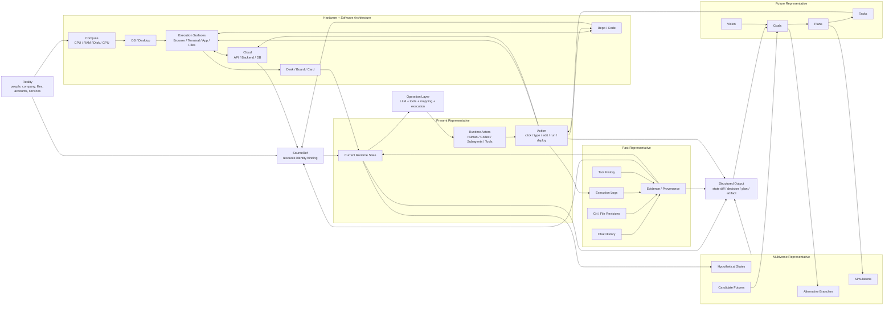

# EG-Desk World Graph

```mermaid
flowchart LR
    Reality["Reality<br/>people, company, files, accounts, services"]

    subgraph Architecture["Hardware + Software Architecture"]
        HW["Compute<br/>CPU / RAM / Disk / GPU"]
        OS["OS / Desktop"]
        Surface["Execution Surfaces<br/>Browser / Terminal / App / Files"]
        Cloud["Cloud<br/>API / Backend / DB"]
        Repo["Repo / Code"]
        Desk["Desk / Board / Card"]
    end

    subgraph Past["Past Representative"]
        Chat["Chat History"]
        Git["Git / File Revisions"]
        Logs["Execution Logs"]
        Tools["Tool History"]
        Evidence["Evidence / Provenance"]
    end

    subgraph Present["Present Representative"]
        State["Current Runtime State"]
        Actors["Runtime Actors<br/>Human / Codex / Subagents / Tools"]
        Action["Action<br/>click / type / edit / run / deploy"]
    end

    subgraph Future["Future Representative"]
        Vision["Vision"]
        Goals["Goals"]
        Plans["Plans"]
        Tasks["Tasks"]
    end

    subgraph Multi["Multiverse Representative"]
        Branches["Alternative Branches"]
        Sims["Simulations"]
        Hypo["Hypothetical States"]
        Candidates["Candidate Futures"]
    end

    Operation["Operation Layer<br/>LLM + tools + mapping + execution"]
    SourceRef["SourceRef<br/>resource identity binding"]
    Output["Structured Output<br/>state diff / decision / plan / artifact"]

    Reality --> HW
    Reality --> SourceRef
    HW --> OS --> Surface
    Surface <--> Cloud
    Surface <--> Repo
    Surface --> Desk
    Cloud --> SourceRef
    Repo --> SourceRef

    Chat --> Evidence
    Git --> Evidence
    Logs --> Evidence
    Tools --> Evidence
    Evidence --> SourceRef

    SourceRef --> State
    Desk --> State
    Evidence --> State

    State --> Operation
    Operation --> Actors
    Actors --> Action
    Action --> Surface
    Action --> Cloud
    Action --> Repo
    Action --> Logs

    State --> Output
    Evidence --> Output
    Action --> Output
    Output --> Goals
    Vision --> Goals --> Plans --> Tasks
    Tasks --> Action

    Goals --> Branches
    Plans --> Sims
    State --> Hypo
    Candidates --> Goals
    Multi --> Output
```

